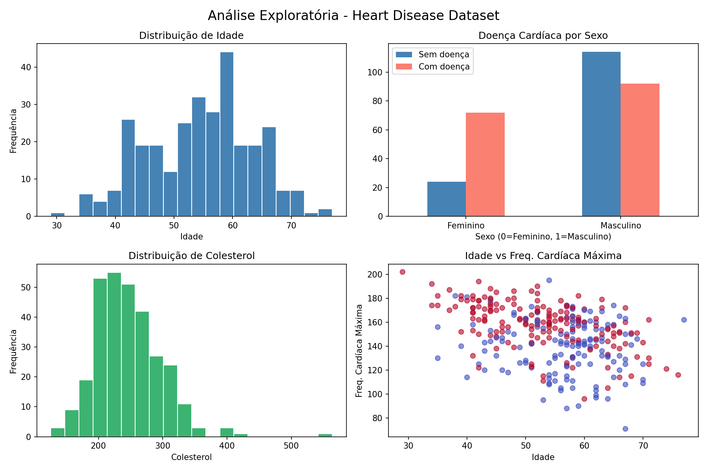

# 🔬 Health Data Quality Analysis


Análise exploratória de dados (EDA) aplicada a um dataset de saúde,
com foco em qualidade de dados — identificando inconsistências, valores
nulos e anomalias como um profissional de QA faria.

---

## 🎯 Objetivo

Demonstrar a combinação entre Data Science e QA aplicados a dados reais
da área da saúde, identificando problemas que comprometeriam análises e
modelos de Machine Learning.

---

## 🔍 Principais Achados

| Verificação | Resultado |
|---|---|
| Total de registros originais | 1.025 |
| Linhas duplicadas encontradas | 723 (70,5%) ⚠️ |
| Registros após limpeza | 302 |
| Valores nulos | 0 ✅ |
| Valores inválidos | 0 ✅ |

> ⚠️ **Bug crítico identificado:** 70,5% dos registros eram duplicatas —
> problema que comprometeria qualquer modelo de Machine Learning treinado
> com esses dados sem tratamento prévio.

---

## 📊 Visualizações



---

## 🛠️ Tecnologias

- Python 3.13
- Pandas
- Matplotlib / Seaborn
- Jupyter Notebook

---

## 📁 Dataset

[Heart Disease Dataset — UCI / Kaggle](https://www.kaggle.com/datasets/johnsmith88/heart-disease-dataset)

---

## 🚀 Como rodar localmente

```bash
# Clone o repositório
git clone https://github.com/seu-usuario/health-data-quality-analysis.git

# Entre na pasta
cd health-data-quality-analysis

# Instale as dependências
pip install pandas matplotlib seaborn jupyter

# Abra o Jupyter
jupyter notebook
```

---

## 📁 Estrutura do Projeto

health-data-quality-analysis/
│
├── data/               # Dataset original
├── notebooks/          # Análise em Jupyter Notebook
├── reports/            # Gráficos e relatório de qualidade
└── README.md

---

## 🧠 O que aprendi

- Análise exploratória de dados com Pandas
- Identificação e tratamento de problemas de qualidade de dados
- Visualização de distribuições e correlações
- Documentação técnica de achados como relatório de QA

---

## 📌 Status

✅ Concluído

---

## 📄 Licença

Este projeto está sob a licença MIT. Consulte o arquivo [LICENSE](LICENSE) para mais detalhes.